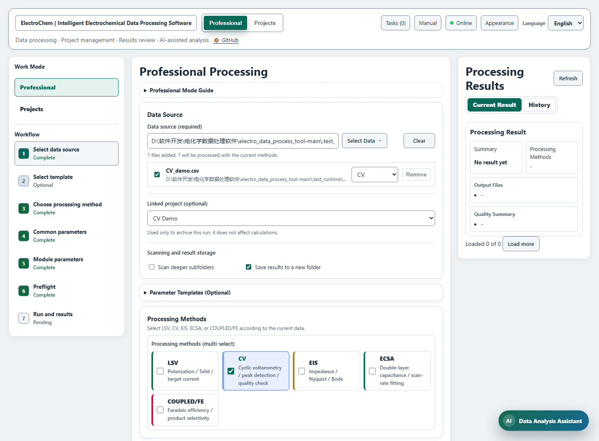
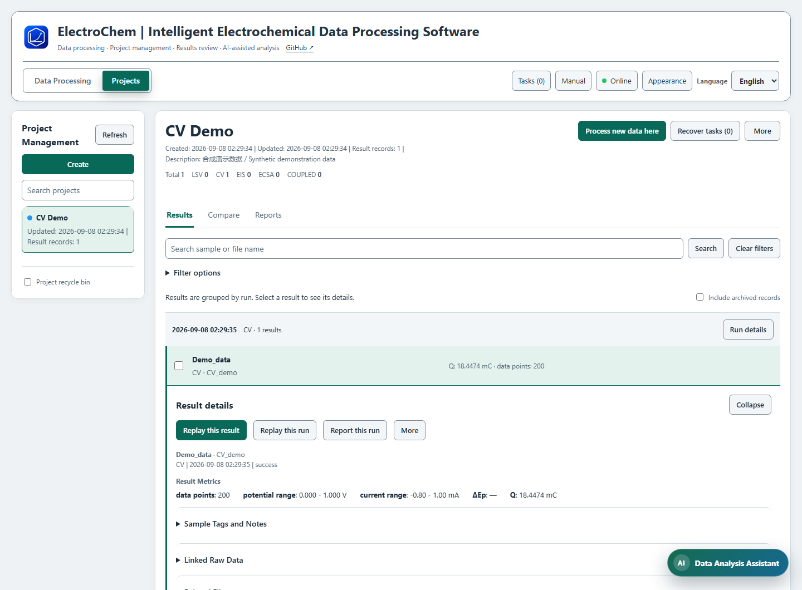

# ElectroChem | Intelligent Electrochemical Data Processing Software — User Guide

This application processes LSV, CV, EIS, ECSA and COUPLED/FE data, with project storage, result comparison, historical replay, reproducible reports and a data analysis assistant. Use Data Processing for calculations and Project Management to organize results. Linking a project is optional and does not affect calculations.

This guide applies to **7.0.1**. Windows upgrades retain existing data locations, projects, history, templates and conversations; see below for macOS desktop storage. Back up application data, original inputs and outputs, finish tasks, exit the client and disconnect MCP clients before upgrading. Preserve old file locations referenced by history after migration. Missing historical parameters or fingerprints cannot be reconstructed automatically; replay uses the current engine and creates new results without replacing the originals.

## Quick start

On Windows, open the installed application from its shortcut. For a source checkout, run `setup.bat`, then double-click `start.bat`, or run `python run_v6.py desktop`. Use `start_browser.bat` for browser mode.

The macOS desktop targets macOS 13+, with separate native arm64 / x64 candidates for Apple Silicon / Intel. Candidates await macOS CI validation; a Mac download is not necessarily available in the public Release. Current builds use ad-hoc signing and are not notarized by Apple. Keep the complete `ElectroChem.app` and open it from Applications. Source users need Python 3.12 matching the chip architecture; run `bash Start_Mac.command` in the repository. The first launch downloads dependencies into `.venv-macos`.

The desktop window starts the local processing service automatically; launching it again activates the existing window for that data directory. The application is named `ElectroChem.exe` on Windows and `ElectroChem.app` on macOS, without a V6 display suffix. Title bars follow the appearance settings. Windows caption controls follow the theme, while macOS draws its own traffic-light controls. System high-contrast settings take priority; the system taskbar and Dock retain their system settings.

1. Open **Data Processing**, click **Select Data**, then **Select Files** or **Select Folder**. Multiple files are supported; the list below shows the actual inputs.
2. Check each file's type and whether it is enabled. Select only the processing methods needed for this run.
3. Enter the area, potential reference and other settings required by the selected method, using your experiment records. Enable **Show advanced settings** in the module, then expand **Instrument columns and units** to verify the columns and units. Load a suitable parameter template if needed and review its contents.
4. Choose a **Linked project (optional)** for storage, or leave **Do not archive to a project** selected.
5. Click **Preflight**. Expand the details and check the actual files, conversions, missing information and auxiliary inputs. Correct any issues and run preflight again.
6. Click **Run Processing**. When finished, inspect the summary, output files and quality summary under **Processing Results → Current Result**. Linked results also appear under **Project Management → Results**.

Default values are starting settings, not experimental evidence. Incorrect area, column mapping, units or potential reference can produce unsuitable results even when the program finishes successfully.



### Practice with the synthetic CV example

[Download the synthetic CV example](guide-cv-demo.csv) and save it as `CV_demo.csv`. This is synthetic teaching data, not an experimental measurement. It has no header and two columns: potential in V, followed by current in A. It contains two 0 → 1 → 0 V cycles, 50 points per half-cycle, 200 rows in total, at a scan rate of 0.05 V/s.

1. Add it through **Select Data → Select Files**. If you kept the name `guide-cv-demo.csv` and it was not recognized automatically, assign CV in the file list and enable it.
2. Select CV only. For this example, set electrode area to `1 cm²`, potential conversion to **Manual offset**, and offset to `0 V`. Retain the original potential; do not convert it to RHE.
3. Enable **Show advanced settings** in the CV module and expand **Instrument columns and units**. Set potential column `1`, current column `2`, potential unit `V` and current unit `A`. Set scan rate to `0.05 V/s` and turn off peak detection.
4. Check that preflight includes this one CV file, then run it. The CV plot should retain `Potential (V)`, with 200 points, potential from 0–1 V and current approximately −0.80–1.00 mA. The absolute integrated charge over both cycles is approximately `18.4474 mC`. ΔEp is empty with peak detection off.

Outputs include a CV PNG, `processing_results.csv`, `quality_report.json`, `summary.json`, `run_report.html`, `run_report.md` and `run_manifest.json`. The sample name comes from the containing folder; the PNG is named “folder-name_CV_demo_CV.png”. Its location depends on the selected folder and output settings.

The example's area, scan rate and offset apply only to this example. Enter the actual conditions before processing your own measurements.

## Data and parameters

### Files, folders and matching rules

Primary LSV/CV/EIS/ECSA inputs support TXT and CSV. File and folder selection populate the same list, where you can enable, exclude, remove or reassign files. Preflight and processing use enabled files whose types are selected. They do not silently add neighboring primary data.

Folder discovery normally includes the selected folder and its first-level subfolders. Enable **Scan deeper subfolders** for deeper data and review the updated list. Generated summaries and combined results are recognized and skipped; do not use an output folder as an original-data folder. Enable **Save results to a new folder** to separate outputs from different runs.

Each module has its own matching strategy: `prefix`, `suffix`, `contains` or `regex`. For example, `LSV_sample01.csv` suits prefix `LSV`; `sample01_LSV_run1.csv` suits a contains rule for `LSV`. Check the actual file list and preflight results. When naming rules are unclear, select files directly and assign their types.

LSV/CV/EIS normally process each file separately. ECSA groups scan rates by the containing folder. Keep each sample in its own folder, for example with `ECSA_20mVs.csv`, `ECSA_40mVs.csv` and `ECSA_60mVs.csv`. At least two distinguishable, valid positive scan rates are required; do not mix different samples into one group.

COUPLED/FE quantification tables, measurement tables, method files and signals are configured separately in that module. Do not assign a product table the type of an LSV or CV curve.

### Verify columns, units and area first

- Enable **Show advanced settings**, then expand **Instrument columns and units**. Column numbers start at `1`. For LSV/CV/ECSA, check potential/current columns and units. For EIS, check frequency, Z′ and Z″ columns, frequency/impedance units and **Imaginary column meaning**.
- Distinguish a signed Z″ column from an already negated −Z″ column. An incorrect selection changes the impedance plot and fit.
- LSV and ECSA use original current and geometric area to obtain current density: `j (mA/cm²) = I (A) × 1000 / A_geo (cm²)`. Do not treat an already normalized current density as raw current and divide by area again.
- CV currently retains the source current sign and reports converted current in mA. It does not apply the common area normalization or potential offset. **Use absolute current** applies to LSV and does not change CV's source sign. Check instrument conventions when distinguishing oxidation and reduction branches.
- Plot titles, axis labels and fonts do not perform unit or reference conversions. Labels must match the actual settings.

### Parameter templates

Expand **Parameter Templates (Optional)**, select a template and click **Load Template**. Name verified settings and use **Save Template** to reuse them; delete custom templates that are no longer needed. After loading, check this run's files, area, units, reference electrode and auxiliary inputs, then repeat preflight.

Project-linked template preview is a separate workflow, described under “Project results, comparisons and reports”.

### Potential reference and iR compensation

Common potential conversion currently applies to LSV. CV retains the original potential after unit conversion, and ECSA's Ev uses the original reference. **Manual offset** adds the specified voltage to LSV potentials. **Convert to RHE** uses:

```text
E_RHE = E_measured + E_ref + (2.303 × R × T / F) × pH
```

Enter temperature in °C; the formula uses K. Reference potentials are relative to SHE. Supply the actual pH, temperature and reference electrode or custom reference potential. The application does not correct liquid-junction potentials, activities or the reference electrode's own temperature drift. The formula and assumptions are recorded with the run. Do not convert an already converted potential again.

LSV iR compensation can use a manual resistance or extract Rs from EIS. Automatic matching can use the LSV folder only, that folder with a root-folder fallback, the root and all subfolders, or a specified EIS file. Sample matching takes priority. Multiple candidates at the same priority require a narrower rule.

```text
E_iR = E_measured − (j_signed / 1000) × A_geo × Rs
```

Here `j_signed` is signed current density in mA/cm², area is in cm² and Rs is in Ω. Preflight checks the EIS pairing and intended method. After processing, check the actual Rs, extraction method and diagnostics in the results and reports. Successful pairing does not mean that Rs extraction has been validated. Do not compensate an already compensated curve again.

### LSV: target current and Tafel fitting

**Target current** means current density in mA/cm² and accepts comma-separated values such as `10,100`. **Tafel range** specifies a current-density interval such as `1-10`. Inspect the original curve, sweep direction and fitting interval alongside the result.

If overpotential is enabled, set `E_eq` on the same reference scale as the data. The calculation is `η (mV) = |E − E_eq| × 1000`. Onset/Halfwave use the configured current thresholds, which must match the experimental method. Check result notices when a target lies outside the measured range or extrapolation was used.

Optional exports include data tables, target-point markers, Tafel plots and combined curves. Quality checks flag point counts, noise, jumps and potential span. A high R² or a passed quality check does not prove that an interval is kinetically controlled.

### CV: cycles, peaks and charge

Use the actual scan rate in V/s, cycle selection and segmentation settings; export selected cycles separately if needed. CV retains the original current sign and potential reference without applying the common area or offset. Charge uses `dt = |ΔE| / scan rate`, then integrates `|I|`. It is absolute integrated charge, not the signed net charge. The scan rate must match the measurement.

Peak detection offers smoothing window, minimum peak height, minimum peak distance and maximum peak count. Compare detected peaks with the original curve; excessive smoothing can alter peak shapes. Closure tolerance, reversal-confirmation threshold and minimum segment points help identify sweeps but do not replace checking incomplete or missing cycles.

### EIS: six models, residuals and KK screening

Enable equivalent-circuit fitting and choose a model supported by the experiment. `∥` denotes parallel elements. Two-branch models label branches 1 and 2 by increasing time constant; neither resistance is automatically identified as Rct.

1. **Ideal RC**: `Rs + (Rct ∥ Cdl)`.
2. **Non-ideal CPE**: `Rs + (Rct ∥ CPE[Q,n])`.
3. **RC with diffusion**: `Rs + (Cdl ∥ (Rct + W[sigma]))`.
4. **CPE with diffusion**: `Rs + (CPE[Q,n] ∥ (Rct + W[sigma]))`.
5. **Two time constants, RC**: `Rs + (R1 ∥ C1) + (R2 ∥ C2)`.
6. **Two time constants, CPE**: `Rs + (R1 ∥ CPE[Q1,n1]) + (R2 ∥ CPE[Q2,n2])`.

W uses the semi-infinite convention `Z_W = sigma(1−j)/√(2πf)` inside the series Rct branch, not in series with the whole circuit. These fitting models do not include finite-length diffusion or inductance. Q has units `S·sⁿ` and equals ideal capacitance only at n=1; Q values with different n are not directly subtracted.

**Frequency limits always use Hz and include both endpoints.** Source kHz values are converted before applying the limits. Leave a bound empty to retain all available frequencies on that side. Circuit fitting and KK screening use the same selected interval without rewriting source data. Selected/excluded counts and indices are saved. Nyquist and Bode plots retain all measurements and overlay the fit only across the selected frequencies.

Choose `uniform` for equally weighted real/imaginary residuals or `modulus` for modulus-normalized residuals with a small-magnitude guard. Weighting changes the objective; compare candidate fits with the same interval and weighting. Deterministic multiple starting points are used. Results retain complex R², RMSE diagnostics, parameters and the acceptance criterion. The default minimum R² of 0.5 is a configurable acceptance setting, not evidence that the physical model is valid.

Parameter diagnostics include approximate local 95% intervals, correlations, boundary hits and identifiability. Intervals depend on the model, weighting and local linearization; they exclude model error. Intervals are withheld with a reason at bounds, rank/conditioning failures or unresolved double branches. High correlation and relaxation times outside the measured interval require review even when R² is high.

**KK screening can run independently.** Its validation expansion and modulus weighting are separate from the chosen circuit and its weighting control. Results are `consistent`, `review` or `unavailable`. Default screening limits are relative RMS≤2% and maximum complex residual≤5%, together with RC-order stability; these are saved heuristics. At least 10 distinct frequencies spanning 2 decades are required. Non-finite values, non-positive frequencies and nearly constant impedance are unassessable. KK consistency does not prove a particular circuit or independently establish experimental linearity or stationarity.

Enabling fitting or KK exports a diagnostics JSON and pointwise residual CSV, plus a residual plot when residuals are available. Circuit residuals use Ω; KK CSV values are relative fractions and the plot shows percentages. Diagnostics, interval, weighting and selected formula snapshots are saved with history/reports. Recalculation creates a new result and retains the old version. The full method and limitations are documented in the repository's `docs/eis_fitting.md`.

### ECSA: evaluation potential and scan-rate groups

**Evaluation potential Ev (V)** is the evaluation potential in V at which forward and reverse currents are compared. It is not a scan rate or step size. ECSA converts source potentials to V and interpolates at Ev without applying the common potential offset. Use the source reference and a non-faradaic region traversed by both sweep directions.

Scan rate is read from the filename or Scan Rate metadata; check the extracted values. **Last N cycles** and **Average last N cycles** determine the complete sweep pairs used. At least two different scan rates are required; two points alone cannot establish linearity.

```text
ΔJ = |J_anodic − J_cathodic| (when absolute difference is enabled)
Cdl_areal = slope(ΔJ versus v) / 2
RF = Cdl_areal / Cs_areal
ECSA = RF × A_geo
```

Check Cs and its unit. `40 µF/cm²` is a common assumption requiring confirmation, not a universal material constant. Cs depends on material, electrolyte, potential window, surface condition and temperature. This is a double-layer-capacitance model estimate, not a direct geometric surface measurement.

### COUPLED/FE: required inputs and quantification

Select a data folder as the path base, then fill **Quantification/measurement table** in the module. Supported formats are CSV/TSV/TXT/XLSX/XLS. Select an Excel sheet by index or name. Relative table paths use the selected data folder; verify the resolved paths in preflight.

For **Use quantified product table**, download **Charge template** or **Current-time template**:

- Each row represents one product for one sample, with `sample`, `product`, `product_moles` and `n`.
- `product_moles` is in mol; `n` is the electron count for that product's reaction. Supply `charge` in C, or `current_mA` and `time_s` as shown in the template.
- Products belonging to the same sample must use the same total charge. Do not duplicate a sample/product pair. Verify that current × time is appropriate before using it to estimate charge.

For **Quantify from signal peaks**, download **Peak measurement template** and supply `sample_name`, `signal_file` and `charge_C`, or valid current and time. Relative signal paths are resolved from the measurement table and must stay within allowed data directories. Check aliquot volume, total electrolyte volume and other quantification conditions.

**Method source** can be **Panel configuration** or **Method file**. The panel accepts internal-standard concentration/added volume, peak positions, quantitative nuclei, product electron counts and response factors; use **Add product** for additional products. File mode uses the JSON **Peak method template**. Replace example peak positions and reaction identifiers with a validated method. Nearby peak location, standard-based shift alignment and constrained fitting are optional; inspect the diagnostic CSV/JSON outputs.

```text
FE_i (%) = z_i × F × N_i / Q × 100
Mole selectivity_i (%) = N_i / ΣN_products × 100
FE selectivity_i (%) = FE_i / ΣFE_products × 100
```

`N_i` is product amount in mol, `z_i` is electron count and Q is total charge. Both selectivities cover only products included in the table. FE selectivity is not absolute FE. Missing products or incorrect volumes or internal-standard settings affect the interpretation.

## Preflight and processing

After **Preflight**, review input counts and types, then expand the details to check columns/units, parameters, EIS pairing and FE method/signal dependencies. Resolve blocking issues and assess warnings against experiment records. Changing input selection or calculation parameters invalidates preflight; run it again.

**Run Processing** submits a background task. Switching projects or minimizing the assistant leaves it running; use **Tasks** to inspect progress. A completed task can still have skipped files, so inspect **Skipped Error Files** and **Error Details**.

**Processing Results** provides **Current Result** and **History**. Current Result shows the summary, output files and quality summary; history opens earlier records. File actions include **Copy Path**, **Open File** and **Open Folder**. The selected modules and export options determine which summaries, images and data files are generated.

## Project results, comparisons and reports

### Create a project and reuse settings

In **Project Management**, click **Create**. Enter a name and optional description in the dialog. Expand **More settings (optional)** for tags, color swatches/custom color and a **Project parameter template**. **Create project** selects the new project; Cancel or Esc creates nothing.

Use **More → Project settings** to edit an existing project. Saving project information does not change the project assigned to the processing form currently being edited.

**Process new data here** opens Data Processing. A linked template first shows differences: choose **Apply template and continue** or **Keep current parameters**. Selected primary data, folders and auxiliary file paths are preserved. Applying parameters requires another preflight. Projects store the template name and use its latest contents next time; historical run settings remain unchanged. If a template was deleted, relink it or continue with current parameters.



### Find and inspect results

**Results** groups records by processing run. Search by sample or filename; expand **Filter options** to specify data type and dates. Filtering covers all project results, including both boundary dates, not just loaded pages. **Load more** retrieves additional matches. **Clear filters** clears text, type and dates; **Include archived records** separately controls archived records.

Click a record for **Result details**, including metrics, quality, original data and associated files. Some COUPLED/FE runs may have no separate sample records, but their run, recipe and report remain available; clear filters to check these runs.

### Compare exact results

Select two records of the same project and type, then choose **Compare selected results**. The **Compare** view shows metrics, parameters, sources and quality for those exact versions; it does not replace them with the newest same-name samples.

Differences are B − A, and relative change is `(B − A) / |A| × 100%`. No percentage is shown when A is zero. Missing values are not zero, incompatible units are not subtracted, and CPE Q is shown side by side if n changes. Experimental conditions, input changes and calculation versions can all cause differences.

**LSV sample summary and charts** separately supports sample filtering/sorting, overlaid curves and metric bars. Select samples, metric and target current density, then choose **Generate compare plot**. Verify the included samples and result sources.

### Replay historical results

Open a result and choose **Replay this result** or **Replay this run**. Select **Use original parameters** or **Modify parameters**, then **Check replay plan**. Verify inputs, parameter differences and calculation versions before **Start replay**.

Relocate moved files; explicitly confirm changed contents. Replay creates a new run and outputs while preserving originals. A single ECSA result depends on multiple scan-rate files; LSV iR depends on EIS; COUPLED/FE depends on the complete table, method and signals. If changed parameters require a different dependency set, return to Data Processing and select complete inputs.

Replay uses the currently installed calculation engine, not an automatically restored old environment. Missing historical parameters or sources are reported as unrecorded; bit-for-bit agreement across versions is not guaranteed. Older ZIP-imported runs can use the retained original archive or a verified recovery cache. A changed archive is not the same source.

### Summarize independent replicates

1. Select same-type experimental records in **Results**, choose **Summarize replicates**, name the group and verify the chosen versions.
2. Give a reason for excluded members. Include only one version of each original source; confirm independence individually for legacy records with incomplete provenance.
3. Review **Check analysis conditions**. If important settings differ or were not recorded, compare experiment records and confirm comparability before viewing statistics. Confirmation cannot override incompatible units or dimensions.
4. Choose **Update statistics**, inspect valid n, mean and sample SD, then **Save replicate group**. Changed members or conditions require another review.
5. Use **Export measurements and statistics CSV** or **Export error bars SVG**. Reopen saved groups through **More → Replicate groups**.

Blue circles represent independent measurements; green diamonds and error bars show mean ± sample standard deviation, using n−1. SD is undefined for n=1; missing data are not zero. SD is not standard error or a confidence interval, and descriptive statistics do not establish significance or causation. Deleted source records are marked missing rather than replaced with another version.

### Generate reproducible reports

In **Reports**, choose **Entire project**, **Selected results** or **Single run**. Verify the scope and click **Generate report**. You can also use **Report selected results** from the selection bar or **Report this run** from result details.

Entire-project reports ignore result pagination, search text and date filters; archived records follow **Include archived records**. Selected-results reports include only checked records, excluding unchecked samples from the same run. Single-run reports include the full run. A run with deleted results can no longer be reported or replayed in full; use remaining individual records.

HTML and Markdown reports include metrics, plots, quality, settings, formulas, input SHA-256 hashes, software/dependency versions and run relationships. Share the accompanying resource folder with a Markdown report. Missing or oversized plots are identified. A report cannot reconstruct missing original inputs.

### Archive and delete

**Archive Record** preserves a record but hides it by default; use **Include archived records** to see it. Projects in **Project recycle bin** can be restored. Permanent project deletion is available only for recycled projects.

Deleting a record or permanently deleting a project removes associated records and unreferenced application-managed outputs. Shared files remain while other records reference them; external original paths are not automatically deleted. Use the top system-status panel for storage statistics and managed-file cleanup.

## Data analysis assistant

### Configure the service and context

Open **Data Analysis Assistant** at the lower right, then **AI Settings**. Select Provider, check the service URL, and enter the API Key. After typing stops, the app queries that address for available models. You can also refresh the list and choose a Model; the current model is never replaced automatically. Check the model, then use **Test** and **Save**. Local calculations in Data Processing do not require AI configuration. Prompt templates can guide a task but cannot replace experimental parameters.

Model discovery queries only the configured model-list endpoint: it sends no chat and does not save a new key automatically. If the service does not support model listing, denies access, or cannot be reached, enter the provider's model ID manually. A listed model is not guaranteed to support the current chat interface. **Test** makes an actual model request and may incur provider charges. Enter the appropriate key after changing providers; saved credentials are not automatically sent to a different site when the service URL changes.

Enter a question and **Send**. **Check current setup** reviews Data Processing parameters; **Summarize recent experiments** queries existing results. The assistant can read current parameters, types, input-source summaries or the project database as needed. Select exact project records before asking for comparisons or reports. Supply missing experimental conditions; filenames do not establish them.

Use **Chats** to switch, rename or delete chats. While a request runs, Send can become **Cancel AI request**; Tasks can return you to its conversation. When an external model service is configured, messages and the context included with the request are processed by that service.

### Review and use action cards

The assistant can prepare **Parameter suggestion**, **Compare selected results**, **Replay plan** and **Selected results report** cards. Click **Review action** and inspect the target, before/after values and reasons before confirming.

**Apply parameters** changes current settings while preserving selected files, but invalidates preflight. Changed settings, sources or targets make old parameter cards stale; request a new card. Comparison cards open exact records. Replay cards open a plan that still requires checking and starting. Report cards set the scope; still click **Generate report** on the report page. Cards persist with the conversation.

Actual writes such as creating a project or automatic processing show a separate confirmation. Check the project, data and scientific parameters. Expired or pre-restart confirmations must be prepared again. A confirmed write cannot be cancelled once execution has started.

### Limits of scientific recommendations

LSV candidate Tafel analysis uses the production parser, unit conversion, area normalization, potential conversion and iR handling. It reports point counts, logarithmic current span, slope, R², residuals and limitations. Missing area, source units, column mapping or other required conditions must be supplied first. A candidate is not a validated kinetic region; other data types currently do not offer candidate fitting.

Performance summaries preserve specific records, runs and units. They do not average recalculation versions as independent experiments or assign grades using arbitrary thresholds. Check explanations against original curves, fit quality and experiment records.

## Tasks and recovery after interruption

When closing the desktop window with active tasks or save operations, choose **Keep using**, **Continue in background**, **Exit after tasks finish**, or **Cancel tasks and exit**. Background mode hides the window; reopen it from the Windows system tray or macOS Dock. On macOS, ⌘Q and the Dock's Quit action also go through the task-aware exit flow. After selecting wait or cancel-and-exit, new operations are blocked until tasks and non-cancellable writes finish safely. Avoid forcibly ending a client while it is saving.

**Tasks** lists processing and AI work. Filter by type/status, inspect stages, per-file progress and errors, and return to a result or conversation. Records remain available after page reload. AI displays its current stage rather than treating stage count as a true completion percentage.

**Cancel** is available only for cancellable work owned by the current program instance. Allow the executor to acknowledge cancellation before retrying. Assistant writes that have already started after confirmation cannot be cancelled.

After an unexpected exit, open **Recover tasks** on the project page; it includes a count when recovery is available. In **Recover interrupted tasks**, choose **Review and preflight** for a task. Verify inputs, parameters and the original process status. Relocate moved files or explicitly confirm changed contents. After checks pass, choose **Recover as a new task** to create a new task, run and outputs while preserving the originals.

Startup never automatically reruns interrupted work. Tasks still owned by a live process cannot be recovered. If an old process identity cannot be verified, first confirm that its program has closed. Recovery recalculates from the beginning; it does not resume at a computation checkpoint. Old queued tasks without hashes show the actual inputs used for the new preflight. ZIP sources can reconstruct verified inputs; recovery performs data processing only and does not resend assistant conversations.

## Appearance and reading

The title bar uses a separate theme background and divider to distinguish window controls from page content. Scrollbars in the page, project lists, dialogs, guide, chat and code areas follow the selected theme. System high-contrast settings take priority.

The desktop **Desktop** menu provides settings, the data folder, legacy-data review, update checks, background operation and exit. It remembers window geometry, appearance, language, the last project and assistant conversation, without restoring input files or experiment parameters. After choosing or dropping TXT/CSV files, verify the input list and run preflight. **Save as** beside result files uses the system save dialog; **Open File** keeps its original behavior. Use **Open Folder** to copy files larger than 32 MB.

Windows installed clients use `%USERPROFILE%\.electrochem\v6`; portable builds explicitly marked with `portable.marker` use `user_data` beside the executable. The macOS desktop uses `~/Library/Application Support/ElectroChem`, outside the `.app`; `ELECTROCHEM_V6_DATA_DIR` can select another writable location outside the bundle. Upgrades retain old data. On first launch, old data can be copied after review if the destination is empty; existing destination data is never merged or overwritten. Historical files may still reference the old folder, which must be retained. Update checks run only on request, select a matching platform/architecture package and open the official download page. Exit safely before installing an update.

The Windows desktop targets Windows 10 22H2 / Windows 11 x64 with WebView2 Runtime 120+. Python and computation dependencies are bundled. The standard installer requires suitable WebView2 on the PC; the `-offline` installer includes Microsoft's standalone runtime. macOS candidates bundle Python and computation dependencies and use the system WKWebView, without WebView2. Basic analysis works offline; cloud AI needs network access. These requirements do not imply that every system version has passed clean-machine acceptance.

Use **Desktop → Environment check** to inspect the OS, architecture, desktop runtime and data directory. Refresh after repairing the environment, or copy the report for troubleshooting; selectable text is available if clipboard access fails. Reports are not uploaded automatically and contain no model keys or experiment data, but directory paths may contain an account name. If the embedded window cannot start, follow the native diagnostic or browser-workspace guidance.

Open **Appearance** and choose an interface style, then a palette. All four styles share the same features and workflow. **Modern** uses soft corners and subtle shadows; **Paper Editorial** uses a margin index, vertically arranged forms and results, fine dividers and serif headings; **Soft Modules** uses a horizontal workflow strip, generously rounded modules and soft shadows; **Pixel Retro** uses square controls and crisp offset shadows. Modern defaults to **Lab Light**; Paper Editorial and Pixel Retro default to **Retro Cream**; Soft Modules defaults to **Misty Blue**. The retired Classic Desktop style migrates to Pixel Retro, preserving an existing Pixel palette; the former Classic palette remains available in the recovered palettes section. Narrow windows rearrange the workflow and results. Text sizes 14/16/18px, comfortable/compact density and background grid are independent, saved immediately and do not change projects, inputs or calculation settings.

All four styles can use nine presets: **Lab Light**, **Professional Ocean**, **High-Contrast Dark**, **Retro Cream**, **Slate Blue**, **Warm Amber**, **Misty Blue**, **Handheld Olive** and **Muted Violet**. Paper Editorial also supports dark palettes. **Custom colors** provides color swatches and hexadecimal fields for the page background, panel background, accent, body text and title bar. Changing colors preserves the style's corners and shadows, and updates scrollbars, the assistant and supported native title bars. A warning identifies low contrast between body text and the panel background; **Match text color automatically** helps improve readability.

Each style remembers its own palette when you switch away and back. **Follow system**, in the palette section, switches between Lab Light and High-Contrast Dark with the system's light/dark preference while retaining the selected style. **Reset this style's colors** restores only that style's default palette, preserving other styles and reading settings. Existing preferences migrate automatically; new styles do not replace existing custom colors or backups. Unused custom colors from older themes remain available under **Previously saved palettes**, where they can be applied again.

Assistant text scales to 15/17/19px, with more generous spacing in comfortable mode. Long code and wide tables scroll locally; use Tab to focus them and arrow keys to scroll.

**Chart preview background** offers **Follow theme** and **Paper white**. Themes do not invert or rewrite scientific data colors; existing comparison PNGs remain unchanged. CSV/SVG exports are independent of the interface theme, with white-background SVGs. Exported plot fonts, axes and grids remain controlled by Data Processing plotting parameters.

**Restore defaults** at the bottom of the dialog clears all four styles' palette choices and previously saved palettes. It restores Modern, Lab Light, standard text, comfortable density, no grid and charts following the theme. It resets appearance only. Esc closes the dialog and returns focus to the opener. Preferences are stored in this browser; unavailable storage is reported as applying changes to the current page only.

## Frequently asked questions

### How can another AI use this application?

Open **Desktop → AI connection (MCP)** and copy the configuration into an AI client supporting local stdio MCP. If it already has `mcpServers` settings, merge only the `electrochem` entry. The default connection can query projects, search results, read run recipes, compare records and preflight data. Enable **Allow new processing jobs and report exports**, then reconnect, to submit calculations and generate reports.

Keep this application running and retain the complete application folder, including `ElectroChem-MCP.exe` on Windows or `Contents/MacOS/ElectroChem-MCP` inside the macOS `.app`. Copy the configuration again after moving the application. Input paths must be on this computer. Ask the AI to inspect parameters and preflight before submitting, then poll the job and use its exact run references to retrieve results. Processing uses new output directories; tasks and results appear in this application's workspace. MCP does not invoke the built-in assistant or change model credentials. Cloud clients supporting only remote HTTP MCP cannot use this local configuration directly.

After a submission timeout or disconnect, check whether a job was created before retrying. Before upgrading, finish tasks, exit the application and disconnect its MCP connection in the AI client.

### Why can I not run, or why are there no results after selecting data?

Check that files are enabled, their types assigned and the corresponding modules selected. Review folder depth, matching rules, preflight blockers and error details. COUPLED/FE requires its module-specific tables and methods. ECSA needs valid different scan rates in the same folder and both sweeps crossing Ev.

### Why are values off by a factor of 1000, or potentials reversed?

Check A/mA/µA, V/mV, area and repeated normalization first. Then inspect the reference, offset, signed current and iR compensation. Changing an axis label cannot fix a calculation.

### Why does a successful task still show quality warnings or missing files?

A task can skip individual invalid files. Inspect the quality summary, skipped-file list and errors. Plot/CSV generation also depends on export options. Quality thresholds do not establish that an experiment or model is correct.

### Why is my project empty, or why is an older result unavailable for replay?

Verify the linked project, clear search/date filters and include archived records if needed. Legacy records may lack a recipe, parameters or source hashes; the application does not substitute current defaults for historical evidence. Use retained original data and explicit settings to create a new run.

### Why can replicate statistics or an assistant suggestion not be applied immediately?

Resolve duplicate source versions, incompatible units/dimensions, missing provenance and inconsistent analysis conditions. An assistant card can also become stale after settings, inputs or targets change. Provide an explicit scope and required experiment conditions before requesting another suggestion.

### What should I do after moving files?

Retain original inputs and their dependencies. Relocate them in replay or recovery and repeat preflight; changed contents require confirmation as new input. Report hashes verify sources but do not contain replacements for the original measurements.

### How do I call the application from scripts or HTTP?

See `docs/api_guide.en.md` in the repository for endpoints, asynchronous tasks, conversation confirmations and examples. The API schema is in `docs/openapi.yaml`. This guide describes the graphical interface.
