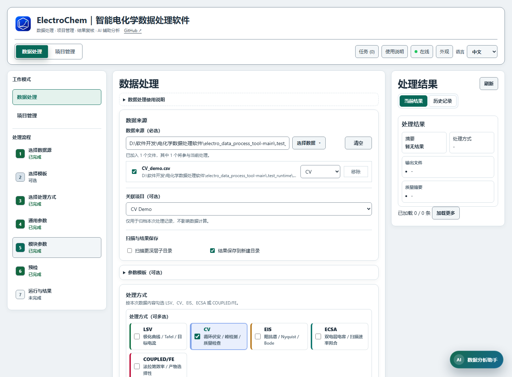
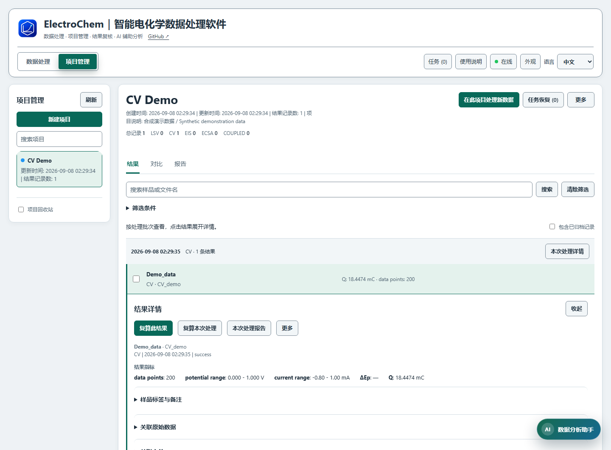

# ElectroChem｜智能电化学数据处理软件 使用说明

本软件用于 LSV、CV、EIS、ECSA 和 COUPLED/FE 数据处理，支持项目归档、结果对比、历史复算、可复现报告及数据分析助手。在“数据处理”中完成计算，在“项目管理”中整理结果；项目关联是可选项，不影响计算。

本说明适用于 **7.0.1**。Windows 升级沿用既有数据目录，保留项目、历史、模板与会话；macOS 桌面数据位置见下文。升级前仍应备份应用数据、原始文件和输出，并结束任务、退出客户端、断开 MCP 连接。迁移后请保留历史引用的旧文件位置。旧历史未记录的参数或指纹不能自动补齐，复算使用当前引擎并创建新结果，不覆盖原结果。

## 快速上手

Windows 安装版从“智能电化学数据处理软件”快捷方式打开；源码版完成 `setup.bat` 后双击 `start.bat`，或运行 `python run_v6.py desktop`。需要浏览器模式时使用 `start_browser.bat`。

macOS 桌面面向 macOS 13+，Apple Silicon / Intel 分别使用 arm64 / x64 原生候选包，尚待 macOS CI 验证，不代表公开 Release 已提供 Mac 下载；当前采用 ad-hoc 签名，未经 Apple 公证。保留完整 `ElectroChem.app` 并从“应用程序”打开。源码需本机架构的 Python 3.12，在仓库目录执行 `bash Start_Mac.command`，首次联网准备 `.venv-macos` 与依赖。

桌面窗口自动启动本地计算服务，重复启动会唤起同一数据目录的已有窗口。Windows 程序名为 `ElectroChem.exe`，macOS 为 `ElectroChem.app`，软件名称不附加 V6。标题栏跟随软件外观；Windows 原生窗口按钮随主题切换，macOS 左上角窗口按钮由系统绘制。系统高对比度设置优先，系统任务栏和 Dock 外观由各自系统控制。

1. 打开“数据处理”，点击“选择数据”，再选“选择文件”或“选择文件夹”。文件支持多选；下方清单列出实际输入。
2. 核对清单中每个文件的类型和是否启用。在“处理方式”中只勾选本次需要的模块。
3. 根据所选模块和实验记录填写面积、电位基准等参数。勾选模块中的“显示高级配置”，展开“仪器列与单位”核对列号及单位；需要复用设置时，再加载合适的参数模板并检查其内容。
4. 如需归档，在“关联项目（可选）”中选择项目；也可以保留“不归档到项目”。
5. 点击“预检”，展开详情，核对实际文件、单位换算、缺失项和辅助输入。修正问题后重新预检。
6. 点击“运行处理”。完成后在“处理结果 → 当前结果”检查摘要、输出文件和质量摘要；关联项目的结果同时进入“项目管理 → 结果”。

参数框里的默认值只是起始设置，不能代替实验条件。面积、列号、单位或参比基准不正确时，即使程序成功结束，结果也可能不适用。



### 用合成 CV 数据熟悉流程

[下载合成 CV 示例](guide-cv-demo.csv)，建议保存为 `CV_demo.csv`。这是教学合成数据，不是实验测量：无表头、两列，第一列为电位 V，第二列为电流 A；电位按 0 → 1 → 0 V 扫描两圈，每个半圈 50 点，共 200 行，扫描速率为 0.05 V/s。

1. 用“选择数据 → 选择文件”加入该文件。若保留了 `guide-cv-demo.csv` 文件名而未自动识别，在清单中手动设为 CV 并启用。
2. 只勾选 CV。为这个合成示例设置电极面积 `1 cm²`、电位换算“手动偏移”、偏移 `0 V`，保留原始电位，不作 RHE 换算。
3. 在 CV 模块勾选“显示高级配置”，展开“仪器列与单位”，设置电位列号 `1`、电流列号 `2`、电位单位 `V`、电流单位 `A`；扫描速率填 `0.05 V/s`，关闭峰检测。
4. 预检确认参与处理的是这一个 CV 文件后运行。打开 CV 图，核对横轴为原始 `Potential (V)`、200 个数据点、电位 0–1 V、电流约 −0.80–1.00 mA；两圈合计绝对积分电荷约 `18.4474 mC`。峰检测关闭时 ΔEp 为空。

应能看到 CV PNG、`processing_results.csv`、`quality_report.json`、`summary.json`、`run_report.html`、`run_report.md` 和 `run_manifest.json`。样品名取自所在文件夹，PNG 名为“文件夹名_CV_demo_CV.png”，保存位置随所选目录和输出设置变化。

该示例的面积、扫描速率和偏移仅适用于示例；处理自己的数据时应重新填写真实条件。

## 数据与参数

### 选择文件、文件夹与匹配规则

LSV/CV/EIS/ECSA 主数据支持 TXT、CSV。选择文件和选择文件夹会进入同一份清单；可以启用、排除、移除文件或修正类型。预检和处理使用清单中启用且属于已勾选模块的文件，不会额外加入同目录的其他主数据。

文件夹默认发现所选目录及一级子目录；需要更深层数据时启用“扫描更深层子目录”，再检查更新后的清单。生成的汇总表、合并结果等会被识别并跳过，不要把输出目录当作原始数据目录。建议启用“结果保存到新建目录”，分开保存每次运行的输出。

各模块独立配置文件匹配策略：`prefix` 匹配前缀，`suffix` 匹配后缀，`contains` 匹配包含词，`regex` 使用正则表达式。例如 `LSV_sample01.csv` 适合前缀 `LSV`，`sample01_LSV_run1.csv` 适合包含词 `LSV`。匹配结果以文件清单和预检为准；不确定命名规则时可直接选择文件并指定类型。

LSV/CV/EIS 通常逐文件处理。ECSA 按文件所在目录组成同一样品的扫速组，建议每个样品单独放一个文件夹，例如同一文件夹内放 `ECSA_20mVs.csv`、`ECSA_40mVs.csv`、`ECSA_60mVs.csv`。至少需要两个可区分的有效正扫速；不要把不同样品混成一组。

COUPLED/FE 的定量表、测量表、方法文件和信号文件在对应模块单独设置，不能把产物表当作 LSV/CV 曲线来指定类型。

### 先确认列号、单位和面积

- 勾选模块的“显示高级配置”后展开“仪器列与单位”。列号从 `1` 开始；LSV/CV/ECSA 核对电位列、电流列及其单位，EIS 核对频率、Z′、Z″ 列、频率/阻抗单位及“虚部列含义”。
- 区分仪器导出的带符号 `Z″` 和已取反的 `−Z″`；选错会改变阻抗图和拟合。
- LSV 和 ECSA 由原始电流及几何面积求电流密度：`j (mA/cm²) = I (A) × 1000 / A_geo (cm²)`。已归一化的电流密度不能直接当成原始电流再次除以面积。
- 当前 CV 保留源电流符号，换算后以 mA 表示；不按通用面积归一化，也不套用通用电位偏移。“使用绝对电流”用于 LSV，不改变 CV 的源符号。需要辨别氧化/还原分支时，应核对仪器符号。
- 图标题、坐标轴文字和绘图字体不会替你完成单位或基准换算。图中文字应与实际参数一致。

### 参数模板

展开“参数模板（可选）”，选择模板后点击“加载模板”；把已核对的设置命名后可“保存模板”，不再使用的自建模板可删除。模板适合复用同类实验设置，加载后仍需确认本次文件、面积、单位、参比电极及辅助输入，并重新预检。

项目关联模板的差异预览与普通加载模板是不同入口，具体见“项目结果、对比与报告”。

### 电位基准与 iR 补偿

通用电位换算目前用于 LSV。CV 保留经单位换算的原始电位，ECSA 的 Ev 也按原始基准设置。“手动偏移”直接给 LSV 电位加上指定的 V 值。“按 RHE 公式换算”使用：

```text
E_RHE = E_measured + E_ref + (2.303 × R × T / F) × pH
```

温度输入为 °C，公式中使用 K；参比电位相对 SHE。填写实际 pH、温度、参比电极或自定义参比电位。软件不校正液接电位、活度或参比电极自身的温度漂移；公式与假设会写入运行记录。已经换算的电位不要重复换算。

LSV 的 iR 补偿可使用手动电阻，或从 EIS 提取 Rs。自动配对可限定同目录、同目录后回退根目录、根目录及全部子目录，或指定 EIS 文件。优先按样品匹配；多个同优先级候选时须收紧规则，不能任取一个。

```text
E_iR = E_measured − (j_signed / 1000) × A_geo × Rs
```

其中 `j_signed` 为带符号电流密度（mA/cm²），面积为 cm²，Rs 为 Ω。预检核对 EIS 配对及拟采用方法；处理完成后，在结果和报告中核对实际 Rs、提取方法及诊断。配对成功不代表 Rs 提取已通过验证；不要对已补偿数据重复补偿。

### LSV：目标电流与 Tafel

“目标电流”按电流密度 mA/cm² 解释，可填逗号分隔的多个值，如 `10,100`。“Tafel 区间”填写对应电流密度范围，例如 `1-10`；结合原始曲线、扫描方向和拟合区间检查结果。

启用过电位后，设置与数据处于同一基准的平衡电位 `E_eq`，软件使用 `η (mV) = |E − E_eq| × 1000`。Onset/Halfwave 按设定电流阈值求电位，阈值需与测试方法一致。目标电流不在实测范围或使用了外推时，先检查结果中的说明。

可按需导出数据表、目标点标记、Tafel 图和合并曲线。质量检测提供点数、噪声、跳变及扫描范围等提示；高 R² 或通过质量检查并不证明所选区间一定代表动力学控制。

### CV：圈数、峰与电荷

按实际实验设置扫描速率（V/s）、圈数选择和循环分段参数；需要时导出指定圈数的单独图。CV 当前保留源电流符号和原始电位基准，不使用通用面积或电位偏移。电荷以 `dt = |ΔE| / 扫描速率` 求时间间隔，再对 `|I|` 积分；它是绝对积分电荷，不是正负电荷抵消后的净值。扫描速率应与实际测试一致。

峰检测可设置平滑窗口、最小峰高、最小峰间距及最大峰数。开启后应核对原始曲线，区分真实峰和噪声；平滑设置过强可能改变峰形。循环闭合容差、反转确认阈值和最少扫描段点数用于识别扫描段，不能替代对缺失或不完整循环的检查。

### EIS：六种模型、残差与 KK 检查

开启等效电路拟合后选择与实验相符的模型。`∥` 表示并联；两支路模型按时间常数从小到大标记为 1、2，不自动把其中一个电阻解释成 Rct。

1. **理想 RC**：`Rs + (Rct ∥ Cdl)`。
2. **非理想 CPE**：`Rs + (Rct ∥ CPE[Q,n])`。
3. **RC + 扩散**：`Rs + (Cdl ∥ (Rct + W[sigma]))`。
4. **CPE + 扩散**：`Rs + (CPE[Q,n] ∥ (Rct + W[sigma]))`。
5. **双时间常数 RC**：`Rs + (R1 ∥ C1) + (R2 ∥ C2)`。
6. **双时间常数 CPE**：`Rs + (R1 ∥ CPE[Q1,n1]) + (R2 ∥ CPE[Q2,n2])`。

W 使用半无限扩散约定 `Z_W = sigma(1−j)/√(2πf)`；它位于 Rct 串联支路内，不能移到整个电路之外。当前拟合模型不包含有限长度扩散或感抗元件。Q 的单位是 `S·sⁿ`，只有 n=1 时才与理想电容一致；不同 n 的 Q 不直接比较差值。

**频率窗口始终填写 Hz，且包括上下端点。** 源数据即使使用 kHz，窗口也按转换后的 Hz 解释；留空表示该侧不限。窗口同时用于本次电路拟合与 KK 检查，不改写源数据。结果保存实际选中/排除点数与索引。Nyquist、Bode 保留全部实测点，拟合线覆盖所选频段。

权重可选 `uniform`（实部、虚部等权）或 `modulus`（按阻抗模值归一化，带小模值保护）。权重会改变目标函数，应在同一频段、同一权重下比较候选结果。拟合采用确定性的多个初值；复数 R²、各类 RMSE、参数和接受阈值均保存。默认最低 R² 为 0.5，仅是接受设置，不代表物理模型已验证。

参数可显示局部近似 95% 区间、相关性、触边及可辨识性诊断。区间依赖模型、权重及局部线性近似，不包含模型误差；触边、秩亏/病态或双支路难以区分时不提供区间并解释原因。强相关、窗口未覆盖时间常数等情况仍需复核，不能只看 R²。

**KK 检查可独立开启**，与电路模型选择、拟合权重分别处理。结果分为“与 KK 一致 / 需复核 / 无法评估”；默认相对残差 RMS≤2%、最大复数残差≤5%，并结合 RC 展开选阶稳定性判断，均为明确保存的启发式阈值。至少需 10 个独立频率并覆盖 2 个 decade；非有限值、非正频率、近乎恒定阻抗等返回无法评估。KK 一致不证明具体电路正确，也不能单独证明实验线性或稳定。

开启拟合或 KK 后导出诊断 JSON、逐点残差 CSV，并在有残差时绘制残差图。电路残差单位是 Ω；KK CSV 保存相对数值，图中显示百分比。诊断与频段、权重、所选模型公式快照写入本次历史/报告，历史复算创建新结果并保留旧版本。完整方法及限制见仓库 `docs/eis_fitting.md`。

### ECSA：评价电位与扫速组

“评价电位 Ev (V)”是取正、反向电流差的评价电位（V），不是扫描速率或步长。当前 ECSA 按源电位单位换算为 V 后在 Ev 插值，不套用通用电位偏移；Ev 应对应原始数据的电位基准，并处于两扫向都经过的非法拉第区间。

扫速从文件名或文件内的 Scan Rate 信息读取；核对提取结果。“最后 N 圈”和“平均最后 N 圈”决定采用的完整扫描对。至少两个不同扫速才可拟合，两点拟合本身不足以检验线性。

```text
ΔJ = |J_anodic − J_cathodic|（启用绝对差时）
Cdl_areal = slope(ΔJ 对 v) / 2
RF = Cdl_areal / Cs_areal
ECSA = RF × A_geo
```

计算前核对 Cs 及单位。`40 µF/cm²` 是需用户确认的常用假设，不能适用于所有材料。Cs 随材料、电解液、电位窗口、表面状态和温度变化；此结果依赖双电层电容模型，不是直接测得的几何表面积。

### COUPLED/FE：配套输入与定量

先选数据文件夹作为路径基准，再在模块内填写“定量/测量表路径”。支持 CSV/TSV/TXT/XLSX/XLS；Excel 的 sheet 可用序号或名称。相对路径按所选数据目录解释，运行前核对预检中的实际路径。

选择“直接读取产物定量表”时，可下载“电荷模板”或“电流时间模板”：

- 每行对应一个样品的一种产物，基本列为 `sample`、`product`、`product_moles`、`n`。
- `product_moles` 使用 mol；`n` 是该产物反应的电子转移数。电荷可填 `charge`（C），或按模板填 `current_mA` 和 `time_s`。
- 同一样品各产物应使用相同的总电荷；不要重复填写同一样品、同一产物。使用电流×时间推算电荷时，应确认其适用于该测量。

选择“从信号峰自动定量”时，下载“峰测量表模板”，填写 `sample_name`、`signal_file`、`charge_C`，或有效电流与时间；信号文件相对测量表定位，并应保存在允许的数据目录内。还需核对取样体积、电解液体积等定量条件。

“方法来源”可选“面板配置”或“方法文件”。面板填写内标浓度/加入体积、峰位、定量核数、产物电子转移数和响应修正因子，并可“添加产物”；文件方式使用“峰方法模板”提供的 JSON。示例峰位和反应标识必须替换为已确认方法。附近自动寻峰、内标偏移校正和约束拟合均为可选，需检查峰诊断 CSV/JSON。

```text
FE_i (%) = z_i × F × N_i / Q × 100
摩尔选择性_i (%) = N_i / ΣN_products × 100
FE 选择性_i (%) = FE_i / ΣFE_products × 100
```

`N_i` 为产物摩尔数，`z_i` 为电子转移数，Q 为总电荷。两种选择性都只针对表内纳入的产物；FE 选择性不是绝对 FE。漏检产物、体积或内标设置错误会影响结论。

## 预检和处理

点击“预检”后，先看实际输入数量与类型，再展开详情核对列/单位、参数、EIS 配对以及 FE 方法与信号依赖。阻止运行的问题需先修正；警告应结合实验记录判断。修改文件清单或计算参数后，原预检会失效，需要重新预检。

“运行处理”提交后台任务。可以切换项目或收起助手，任务继续执行；顶部“任务”可查看阶段和进度。完成状态不代表每个文件都成功，请同时检查“跳过的错误文件”和“错误详情”。

“数据处理”页的“处理结果”提供“当前结果”和“历史记录”。在当前结果中查看摘要、输出文件、质量摘要；从历史记录打开具体结果。输出文件可使用“复制路径”“打开文件”“打开目录”。汇总表、图像和导出数据取决于勾选的模块与导出选项。

## 项目结果、对比与报告

### 新建项目与常用设置

进入“项目管理”，点击左侧“新建项目”。在弹窗中输入名称，可填项目说明；展开“更多设置（可选）”后设置标签、颜色色块/自定义颜色及“常用参数模板”。点击“创建项目”后自动选中；取消或 Esc 不会创建。

已有项目从“更多 → 项目设置”修改信息。保存项目设置只更新项目，不会改变正在编辑的处理任务归属。

点击“在此项目处理新数据”进入“数据处理”页。关联了模板的项目会先展示差异：选择“应用模板并进入”才应用参数，或“保留当前参数进入”。已选择的主数据、文件夹和辅助文件路径保留；应用参数后需要重新预检。项目关联的是模板名称，模板更新后下次使用最新内容；历史运行参数保持原样。模板已删除时应重新关联，或保留当前参数继续。



### 搜索与查看结果

默认“结果”按处理批次显示。搜索样品或文件名；展开“筛选条件”限定类型和起止日期。筛选作用于项目全部结果，日期包含起止当天，不限于已加载页；“加载更多”继续显示匹配记录。“清除筛选”清除关键词、类型和日期，归档范围仍由“包含已归档记录”控制。

点击结果展开“结果详情”，查看指标、质量、原始数据和关联文件。部分 COUPLED/FE 运行可能没有单独样品记录，仍可查看其批次、配方和报告；清除筛选后检查这些批次。

### 指定结果对比

在“结果”勾选两条同项目、同类型记录，点击“对比所选结果”。“对比”页比较指定版本的指标、参数、来源和质量，不会换成同名样品的最新版本。

差值为 B − A，相对变化为 `(B − A) / |A| × 100%`；A 为零时不显示百分比。缺失值不当零，单位不兼容时不直接相减；CPE n 改变时 Q 只并列展示。不同实验条件、输入或计算版本均可能造成差异。

“LSV 样品汇总与作图”另提供样品筛选、排序、叠加曲线和指标柱状图。选择样品、指标和目标电流密度后点击“生成对比图”，并核对采用的样品和结果来源。

### 历史复算

展开结果后点击“复算此结果”或“复算本次处理”。选择“使用原参数复算”或“修改参数后复算”，点击“检查复算计划”，核对输入、参数差异与计算版本；通过后“开始复算”。

文件移动后可重新定位；内容改变时需明确确认使用新内容。复算生成新运行、新输出并保留原记录。ECSA 单条结果依赖同组多个扫速文件；LSV iR 依赖原 EIS；COUPLED/FE 依赖完整定量表、方法和信号。若修改参数改变所需依赖范围，应回到“数据处理”页选择完整输入。

复算使用当前安装的计算引擎，不会自动启动旧版本环境。旧记录缺少参数或来源时会显示未记录，不能承诺跨版本逐位一致。来自旧 ZIP 导入的运行，可利用已保存原包或经过校验的恢复缓存；原包变化不能当作同一来源。

### 汇总独立重复实验

1. 在“结果”勾选同类型实验记录，点击“汇总重复实验”，填写组名并核对采用版本。
2. 不纳入的成员填写排除原因；同源数据的复算版本只能纳入一个。来源不完整的旧记录需逐条确认独立性。
3. 检查“计算口径核对”。关键设置不同或未记录时，先核对实验记录并确认可比较，再查看统计；确认不能绕过单位或量纲不兼容。
4. 点击“更新统计”，核对各指标有效 n、均值和样本标准差，之后“保存重复组”。成员或条件改变后需重新核对。
5. 可“导出测量点与统计 CSV”或“导出误差条 SVG”，保存的组从“更多 → 重复实验组”重新打开。

蓝色圆点表示独立实验，绿色菱形及误差条表示均值 ± 样本标准差（分母 n−1）。n=1 时标准差未定义；缺失值不按零处理。标准差不是标准误或置信区间，这些描述统计也不直接判断显著性或因果关系。删除成员记录后组内会标记缺失，不会自动改用另一个版本。

### 生成可复现报告

进入“报告”，选择“整个项目”“所选结果”或“单次处理”，核对范围后点击“生成报告”。也可从结果勾选条进入“所选结果报告”，或从详情打开“本次处理报告”。

整个项目不受结果分页、关键词和日期筛选限制；归档记录是否包含沿用“包含已归档记录”。所选结果只包含勾选记录，不连带同批次其他样品；单次处理包含完整运行。已删除部分结果的运行不能再整次报告或整次复算，可使用剩余结果。

报告提供 HTML 和 Markdown，包含指标、图表、质量信息、参数、公式、输入 SHA-256、软件/依赖版本及运行关系。Markdown 分享时需同时带上配套资源目录。丢失或超过体积限制的图表会在报告中说明，不能凭报告重新生成缺失的原始输入。

### 归档与删除

“归档记录”保留数据但默认隐藏，可用“包含已归档记录”查看。项目移入“项目回收站”后可以“恢复项目”；“永久删除项目”只对回收站项目开放。

删除记录或永久删除项目会清理对应记录及不再被引用的应用托管输出。仍被其他记录引用的文件保留，外部原始路径不会被自动删除。存储统计和托管文件清理在顶部系统状态面板中查看。

## 数据分析助手

### 配置并提供上下文

打开右下角“数据分析助手”，进入“AI设置”，选择 Provider，核对服务地址，再输入 API Key。停止输入后会自动查询该地址的模型列表，也可手动刷新并从候选列表选择 Model；原来填写的模型不会被自动替换。确认模型后，可“测试连接”再“保存”。本地数据处理无需配置 AI。提示词模板可按任务选择，但不能替代实验参数。

获取模型只查询所填服务地址的模型列表，不发送对话，也不会自动保存新密钥。服务不支持模型列表、权限不足或网络失败时，仍可手动填写服务商提供的模型 ID。列表中出现某个模型不代表当前对话接口一定可用，“测试连接”会实际请求该模型，可能产生服务商费用。切换 Provider 后需输入对应密钥；更换服务地址到另一站点时，已保存密钥不会自动发送给新站点。

输入问题后“发送”。“检查当前设置”适合审阅数据处理参数；“总结最近实验”适合查询已有结果。助手按需读取当前参数、类型、输入来源摘要或项目数据库；在项目页先勾选具体结果，再说明要比较或报告的对象。未记录的实验条件需要补充，不能从文件名推定。

通过“会话”切换、重命名或删除聊天。发送期间按钮可变为“取消 AI 请求”；顶部任务面板也可返回对应会话。若使用外部模型服务，消息和随请求提供的上下文将交给所配置的服务处理。

### 阅读建议并执行操作卡

助手可生成“参数建议”“比较指定结果”“复算计划”“所选结果报告”等卡片。点击“查看操作”，检查对象、修改前后值和理由，再选择确认。

参数卡通过“确认应用参数”修改当前设置，保留输入文件，但原预检失效。参数、来源或目标改变后，旧卡不能继续应用，应重新生成。对比卡打开指定结果；复算卡只进入复算计划，仍需检查后开始；报告卡限定范围，仍需在报告页点击“生成报告”。卡片随会话保存。

创建项目或自动处理等实际写入操作会另行显示确认内容，先核对项目、数据和关键科学参数。过期或软件重启前留下的确认需要重新生成；确认后已开始的写入阶段不可中途取消。

### 科学建议的边界

LSV 的候选 Tafel 区间分析复用正式解析、单位换算、面积归一化、电位及 iR 处理，列出点数、对数电流跨度、斜率、R²、残差和局限。缺少面积、源单位、列映射等必要条件时先要求补全。候选区间不等于已验证的动力学区间，当前其他类型暂不提供候选拟合。

性能摘要保留具体记录、运行和单位，不把复算版本平均成独立实验，也不据任意阈值给出优劣等级。把助手的解释与原始曲线、拟合质量和实验记录一起核对。

## 任务与异常退出恢复

桌面版关闭窗口时，若仍有任务或保存操作，会先显示退出选择：“继续使用”“后台继续”“等待完成后退出”“取消任务后退出”。后台继续会隐藏窗口，Windows 从系统托盘、macOS 从 Dock 重新打开；macOS 的 ⌘Q 和 Dock“退出”也经过任务退出保护。选择等待或取消退出后停止接收新操作，并等待任务和不可取消的写入安全结束。不要强行结束正在保存的客户端。

顶部“任务”统一显示处理和 AI 任务。可按类型、状态筛选，查看阶段、逐文件进度、失败详情，并跳转结果或会话；刷新页面后任务记录仍可查看。AI 请求显示当前阶段，不将阶段数当作真实完成百分比。

“取消”仅用于当前程序实例内可取消的任务；取消请求需等待执行器响应，确认完成后再重试。已经开始的助手确认写入不提供取消。

异常退出后，点击项目页“任务恢复”（有待恢复任务时显示数量），打开“异常退出后的任务恢复”弹窗，再点击任务的“查看并预检”。核对输入、参数和原进程状态；文件移动可重新定位，内容改变需明确确认。通过后点击“恢复为新任务”，生成新任务、运行和输出，保留原记录。

启动软件不会自动重跑。仍由活跃进程执行的任务不能恢复；旧记录无法核实身份时，需先确认原程序已关闭。恢复是重新计算，不是从中断计算点续跑。旧排队任务缺少指纹时会展示本次实际输入。ZIP 来源可按校验重建输入；恢复仅执行数据处理，不重发助手对话。

## 外观与阅读

标题栏采用独立的主题底色和分界线，便于区分窗口操作区与页面内容。页面、项目列表、弹窗、说明正文、聊天和代码区的滚动条也跟随主题，系统高对比度设置优先。

桌面版顶部“客户端”菜单提供设置、打开数据目录、旧数据迁移检查、检查更新、后台继续和退出。客户端记住窗口位置、外观、语言、上次浏览的项目和助手会话；不恢复输入文件或实验参数。通过“选择文件／文件夹”导入后仍需核对清单并预检；Windows 还支持拖入 TXT/CSV，macOS 当前使用选择窗口导入。结果文件旁的“另存为”使用系统保存窗口，原“打开文件”行为保持不变。超过 32 MB 的文件请使用“打开目录”后复制。

Windows 安装版默认数据位置为 `%USERPROFILE%\.electrochem\v6`；明确带有 `portable.marker` 的便携版使用程序旁的 `user_data`。macOS 桌面使用 `~/Library/Application Support/ElectroChem`，不在 `.app` 内保存数据；可用 `ELECTROCHEM_V6_DATA_DIR` 指定应用外的可写目录。升级不清除旧目录。首次发现旧数据且目标为空时可确认复制；已有目标数据不合并、不覆盖。历史文件仍可能引用旧目录，请保留原目录。检查更新仅在点击时联网，按平台与架构查找匹配包并打开官方下载页面；安装新版前先安全退出客户端。

Windows 客户端面向 Windows 10 22H2 / Windows 11 x64，需要 WebView2 Runtime 120+。安装版已内置 Python 和计算依赖；标准包需要电脑已有合适 WebView2，文件名带 `-offline` 的离线包包含微软独立运行库。macOS 候选包内置 Python 与计算依赖，使用系统 WKWebView，不需要 WebView2。基础分析可离线使用，云端 AI 需要网络。支持门槛不等于每个系统版本都已完成实机验收。

通过“客户端 → 环境自检”查看系统、架构、桌面运行库和数据目录检查结果。修复后点击“刷新”，需要排查时可“复制诊断”；复制失败可手动选择文本。诊断不会自动上传或安装组件，不包含模型密钥或实验数据，但目录路径可能包含账户名。无法启动桌面窗口时可按原生提示查看诊断或使用浏览器工作区。

顶部“外观”先选择界面风格，再选择配色。四种风格使用相同功能与工作流程：“现代简洁”采用柔和圆角与轻阴影；“纸感编辑”以侧边目录、连续排列的表单与结果、细线分隔和衬线标题组织阅读；“柔和模块”使用顶部横向流程、大圆角模块与柔和阴影；“像素复古”保留直角控件与硬边阴影。现代简洁默认搭配实验室浅色；纸感编辑、像素复古默认搭配复古米白；柔和模块默认搭配雾灰蓝。旧版“经典桌面”会切换为“像素复古”；保留已有像素配色，原经典配色可从“此前保存的配色”恢复。窄窗口会重排流程与结果。字号 14/16/18px、舒适/紧凑密度和背景网格独立设置，即时保存，不改变项目、输入或计算参数。

四种风格都可搭配实验室浅色、专业深海、高对比暗色、复古米白、石板蓝、暖黑琥珀、雾灰蓝、掌机黄绿、灰紫九组预设，也可选择“自选颜色”，通过色块或十六进制色值调整页面背景、面板背景、强调色、正文文字和窗口标题栏。纸感编辑也可使用深色配色。切换配色保留风格的边角与阴影，并同步滚动条、助手与支持配色的原生标题栏。正文与面板背景对比不足时会提醒，可点击“自动匹配文字颜色”提高对比度。

每种风格分别保存配色，切换回来自动恢复。“跟随系统”位于配色区，随系统亮暗自动切换实验室浅色和高对比暗色，保留当前风格。“恢复当前风格配色”只还原该风格的默认颜色，保留其他风格和阅读设置。旧设置自动迁移，新增风格不会覆盖原来的自选颜色和备份；未采用的旧自选颜色保存在“此前保存的配色”中，展开后可重新应用。

助手正文随字号调整为 15/17/19px；舒适模式行距较宽。长代码和宽表格可局部横向滚动，用 Tab 聚焦后可用方向键操作。

“图表预览背景”可选“跟随主题”或“论文白底”。主题不会反色或改写科学图的数据颜色；既有比较 PNG 以原图展示。CSV/SVG 导出不随界面主题变化，SVG 保持白底；绘图文件的字体、坐标轴和网格仍由“数据处理”页的绘图参数控制。

弹窗底部“恢复默认”清除四种风格的配色选择和旧配色备份，并恢复现代简洁、实验室浅色、标准字号、舒适密度、关闭网格和图表跟随主题；只重置外观。Esc 关闭弹窗并返回入口焦点。设置保存在当前浏览器；无法持久保存时会提示仅本次页面生效。

## 常见问题

### 如何让其他 AI 调用本软件？

桌面版打开“客户端 → AI 连接（MCP）”，复制配置到支持本地 stdio MCP 的 AI 客户端；已有 `mcpServers` 配置时只合并 `electrochem` 项。默认可查询项目、搜索结果、读取运行配方、比较记录和预检。勾选“允许新建处理任务和导出报告”后重新连接，即可提交计算与生成报告。

保持本软件运行，并保留完整客户端文件夹（Windows 包括 `ElectroChem-MCP.exe`；macOS 保留 `.app` 内的 `Contents/MacOS/ElectroChem-MCP`）。移动应用后重新复制配置。数据路径必须位于本机。AI 应先查询参数并预检，再提交任务、查询进度，按返回的运行标识读取结果。处理使用新的输出目录，任务与结果在本软件中显示。MCP 不会调用内置助手或修改模型密钥；仅支持远程 HTTP MCP 的云端 AI 不能直接使用此本地配置。

提交超时或连接中断时，先查看任务是否已创建再重试。升级软件前，结束任务、退出软件，并断开 AI 客户端的 ElectroChem MCP 连接。

### 选了数据，为什么不能运行或没有结果？

检查文件是否已启用、类型是否已指定、对应处理模块是否勾选，以及文件夹层级和匹配规则。再看预检阻止项和错误详情。COUPLED/FE 要在模块内提供配套表与方法；ECSA 要有同目录的有效不同扫速及两扫向穿越 Ev。

### 数值差了 1000 倍，或电位方向不对？

优先核对 A/mA/µA、V/mV、面积及是否重复归一化，再检查参比基准、偏移、带符号电流和 iR 补偿。修改坐标轴标题不能修正计算。

### 任务成功，为什么仍有质量警告或文件缺失？

任务可能跳过个别错误文件；检查当前结果中的质量摘要、跳过清单和各项错误。图像或 CSV 是否输出也取决于模块导出开关。质量阈值不能证明实验或模型一定正确。

### 为什么项目结果为空，或旧结果不能复算？

确认运行是否关联了当前项目，清除搜索/日期筛选，并按需包含归档记录。旧历史缺少运行配方、参数或输入指纹时，软件不会用当前默认值补成历史证据。应从保留的原始数据明确设置参数后创建新运行。

### 重复实验统计或助手建议为什么不能直接应用？

先解决同源版本、单位/量纲不一致、缺失来源及计算口径问题。助手旧卡还可能因当前参数、输入或目标变化失效；重新提供明确对象和必要实验条件后再生成建议。

### 文件移动后如何继续？

保留原始文件及配套依赖。在复算或恢复窗口重新定位并预检；内容改变需确认作为新输入。报告中的指纹用于核对来源，不包含可替代原始测量的完整数据。

### 如何通过脚本或 HTTP 调用？

接口、异步任务、会话确认与示例见仓库中的 `docs/api_guide.zh.md`；接口结构见 `docs/openapi.yaml`。本手册按图形界面介绍操作。
